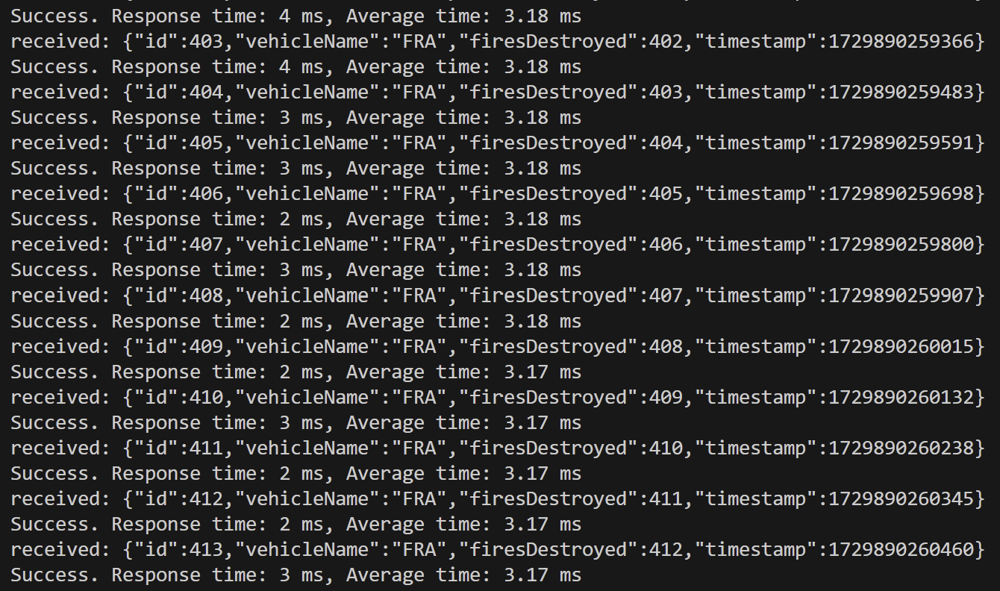

# Thoughts

## average response time: 
**~3 ms**
I think it's actually closer to 2.something ms but i think sometimes when the client is first ran it'll take a while longer to send/receive updates but it averages to a little under 3 ms

EDIT*: from 3 sources its around 3.17-3.18

**Data from 3 sources:** 

## Experience
Installation and setup wasn't too bad since the process is pretty straightforward, just download and follow the steps. PgAdmin is the development platform which is also straightforward to download. There's also a vscode extension for postgresql (idk if this is required for it to work but I used it) and it displays the data and stuff but PgAdmin has more features. Figuring it out at first was a bit rough since I was kinda lost on where to start but there's a lot of videos/forums/docs so I was able to figure it out in a couple days. A lot of videos use visual studio instead of vscode but they're similar enough so that they're still helpful. Also postgres doesn't have datetime data type (what I originally thought of using) but they do have time with timezone and abunch of other alternatives which are pretty similar. In the end though, I just went with bigInteger to store unix timestamp.

# Installation/Extra steps:
postgres download (I used version 16): https://www.postgresql.org/download/

pgadmin download: https://www.pgadmin.org/download/

install packages using these:

1. `dotnet add package Microsoft.EntityFrameworkCore`
2. `dotnet add package Npgsql.EntityFrameworkCore.PostgreSQL`

# Other Stuff
So I never wrote any actual SQL. According to this, I use context to actually interact with the database. 

https://www.npgsql.org/efcore/?tabs=onconfiguring

npsql is "the open source EF Core provider for PostgreSQL. It allows you to interact with PostgreSQL via the most widely-used . NET O/RM from Microsoft, and use familiar LINQ syntax to express queries."